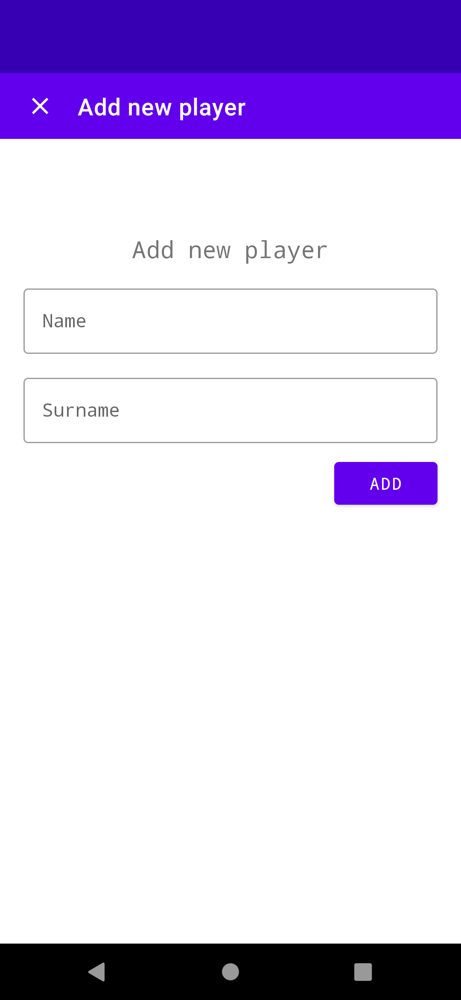

# ShuffleUs

### Content

- Overview
- Installation
- User guide

## Overview

***ShuffleUs*** is an Android application for generating random groups of players for a specified interval. 
> The goal is to distribute people into groups where they can talk to each other. After some time an alarm goes off and a new group distribution is generated.

## Installation

Downloadable form Google Apps to devicues running at least Android API level 29.
>TBD 

## User guide
Everything is running locally. Internet connection is needed only for random image generator.

### Shuffle
In order to create new groups just hit the ***shuffle*** button on the main page. The countdown automatically starts.

Hitting the ***shuffle*** button again will stop and reset the timer.

    
    

> One group distribution with groups of size two and one with groups of size four. 

After the time interval expires a notification is issued. Right in the notification the timer can be reseted without changing the groups.

    

### Settings
Hitting the ***settings*** button on the main page will load the settings page. Here you can change group size, time interval and group names.

You can also manage all the players. Deleting is done simply by clicking the *delete* icon button. You can also suspend players form playing by unchecking the *Playing* box.

Adding players is done via *add* button at the bottom of the screen. Dialog is invoked where you can add a new player after filling the name and surname box.
> The picture is downloaded automatically at random from the internet.

    
    

